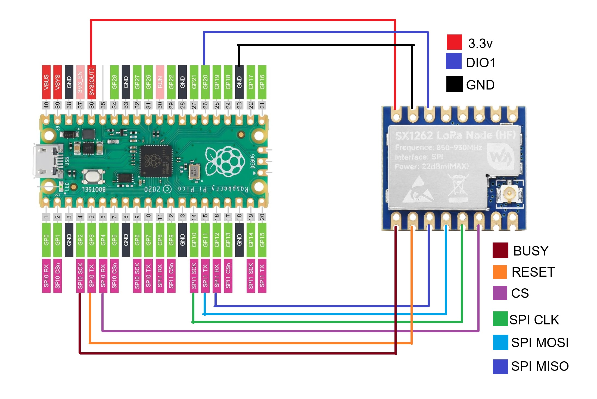

# Raspberry Pi Pico Mesh Pinger
This is an example project demonstrating how to use the [MTSimpleBroadcast](https://github.com/jrddupont/MTSimpleBroadcast) library to broadcast messages over the Meshtastic network using a Raspberry Pi Pico and a LoRa radio module.

## Example Usage
### Environment
Running on a [Raspberry Pi Pico 1](https://www.raspberrypi.com/products/raspberry-pi-pico/) with a [Waveshare Core1262](https://www.amazon.com/dp/B09LV2W64R)    
Make sure you have an antenna connected to the LoRa module *before* powering it on, as operating without an antenna can damage the radio.
  
Requires these libraries:
* jgromes/RadioLib
* rweather/Crypto
* densaugeo/base64  

### Wiring
Waveshare Core1262 <-> Raspberry Pi Pico 1

Core1262 Pin      | Pico Pin
------------------|----------------
VCC               | 3V3(OUT)
GND               | GND
MISO              | GPIO12
MOSI              | GPIO11
SCK               | GPIO10
CS                | GPIO4
DIO1 (IRQ)        | GPIO20
RESET             | GPIO3
BUSY              | GPIO2

